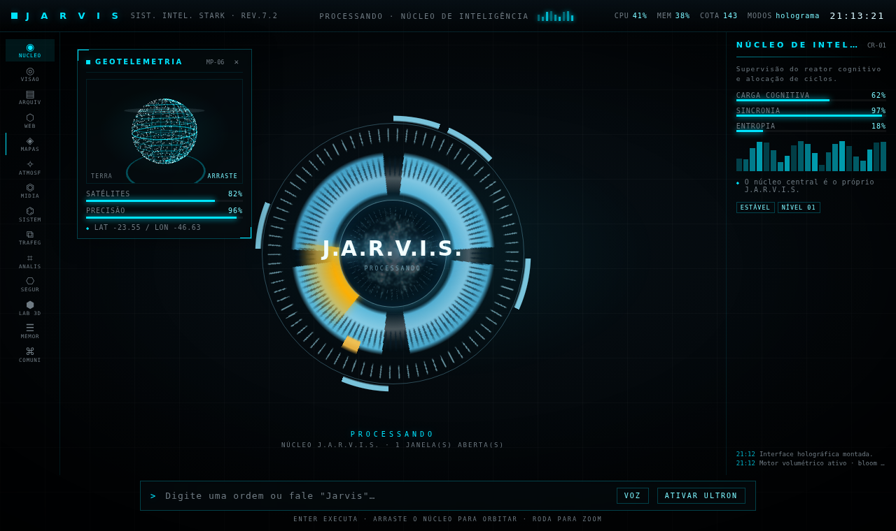

# James — assistente de voz local estilo Jarvis (Windows)

Assistente de voz que roda na sua máquina: escuta uma palavra de ativação,
entende o comando, responde falando e executa ações no sistema — sempre atrás
de uma camada de permissão que não confia no julgamento do modelo.

**Estado atual:** Fases 0 a 20 implementadas, mais o grafo de memória e a partida do Ultron. 1178 testes automatizados.
O estado detalhado e o desenho do que vem a seguir estão em [PLANO.md](PLANO.md).

---

## Divisão de trabalho entre os modelos

Cada modelo faz o que só ele faz bem, e cada um tem cota independente — o que
na prática dobra o uso diário possível.

| Papel | Quem faz | Unidade cobrada |
|---|---|---|
| **Percepção** | Gemini | requisições — ouve o áudio e transcreve |
| **Raciocínio** | OpenRouter | requisições — decide, planeja, escreve, chama ferramentas |
| **Visão** | Gemini, OpenRouter | requisições — analisa tela e câmera |
| **Voz** | ElevenLabs, Piper | **caracteres** — só lê em voz alta |

A última linha é a que faz a conta fechar: **a ElevenLabs nunca vê a
conversa.** Ela recebe a frase final e mais nada. Raciocínio, histórico,
resultado de busca e descrição de imagem ficam fora da cota de voz — o que é
cobrado é só o que sai pelo alto-falante.

O fluxo tem um efeito colateral valioso: como a transcrição chega **antes** do
raciocínio, o roteador local pode interceptar comandos frequentes e resolvê-los
sem gastar a requisição cara.

```
áudio → Gemini transcreve            [1 requisição barata]
      → roteador local casou?  → executa              [0 requisições]
      → senão → OpenRouter decide e responde          [1 requisição]
```

Cada papel tem uma **cadeia**, não um provedor fixo (`llm.roles` no
`config.yaml`): se o preferido cair, o seguinte assume.

---

## Instalação

### 1. Dependências

```bash
python -m venv .venv
.venv\Scripts\activate
pip install -e ".[dev]"
pip install -e ".[office]"     # opcional: PowerPoint e Excel
pip install -e ".[camera]"     # opcional: análise de câmera
pip install -e ".[gestures]"   # opcional: modo de gestos (desligado por padrão)
```

### 2. Chaves de API

```bash
copy .env.example .env
```

| Variável | Onde conseguir | Para quê |
|---|---|---|
| `GEMINI_API_KEY` | [aistudio.google.com/apikey](https://aistudio.google.com/apikey) | ouvir e ver |
| `OPENROUTER_API_KEY` | [openrouter.ai/keys](https://openrouter.ai/keys) | pensar e agir |
| `PORCUPINE_ACCESS_KEY` | [console.picovoice.ai](https://console.picovoice.ai) | palavra de ativação — **opcional**, veja abaixo |
| `ELEVENLABS_API_KEY` | [elevenlabs.io](https://elevenlabs.io) | voz na nuvem (opcional) |
| `LMNT_API_KEY` | [app.lmnt.com](https://app.lmnt.com) | voz na nuvem, plano C (opcional) |

O `.env` está no `.gitignore`. Nunca comite ele.

> **Sobre a chave da Picovoice:** o console deles recusa e-mail pessoal —
> tentar criar conta com Gmail devolve *"Please enter a valid company email"*.
> É uma barreira comercial, não técnica, e não decide se o James liga. O
> padrão é o **openWakeWord**, que não pede conta nenhuma. Veja
> [Palavra de ativação](#palavra-de-ativação-três-caminhos).

### 3. Voz do Piper (TTS)

Baixe uma voz pt-BR de [rhasspy/piper-voices](https://huggingface.co/rhasspy/piper-voices)
— o par `.onnx` **e** `.onnx.json` — e coloque em `voices/`. O caminho vai em
`tts.voice_path` no `config.yaml`.

Se o pacote `piper-tts` não funcionar na sua máquina, baixe o `piper.exe` e
aponte `tts.binary` — o projeto usa os dois caminhos.

### 4. whisper.cpp (opcional)

Baixe o binário e um modelo `ggml-tiny-q5_1.bin`, e configure `stt.binary` e
`stt.model`. Ele serve para o **modo offline** e para a **confirmação de ações
de risco** por voz. Sem ele, a confirmação acontece por janela (veja PIN
abaixo) — nada fica impossível.

---

## Primeira execução — na ordem

Os cinco passos abaixo são sequenciais. Pular o primeiro é o erro mais comum, e
ele se manifesta lá na frente como `ModuleNotFoundError`, que parece outra
coisa.

```bash
# 1. Instalar (é isto que traz PySide6, openWakeWord e webrtcvad)
python -m venv .venv
.venv\Scripts\activate
pip install -e ".[dev]"

# 2. Chaves de API
copy .env.example .env        # GEMINI_API_KEY já basta para começar

# 3. Voz do Piper — download manual, ver a seção de instalação
#    voices/pt_BR-faber-medium.onnx  +  o .onnx.json ao lado

# 4. Conferir a máquina
python check_hardware.py      # leia o VEREDITO, ele diz o que falta

# 5. Rodar
python wake_listener.py
```

**Como ler o relatório do passo 4:**

| Marca | Significa |
|---|---|
| `[  OK  ]` | Funciona nesta máquina |
| `[FALTA ]` | Biblioteca não instalada — volte ao passo 1 |
| `[FALHOU]` | Instalada, mas não funciona aqui — é problema de verdade |
| `[ AVISO]` | Opcional ausente; o James roda sem |

O veredito começa com `PRIMEIRO ISTO:` quando o que falta é só instalação.

O `wake_listener.py` sobe e supervisiona o orquestrador sozinho — os dois
processos com um comando só.

Diga **"Hey Jarvis"** e depois o comando. `Ctrl+Alt+J` cancela qualquer coisa
em andamento. `python set_pin.py` define um PIN para as ações de risco
(opcional).

### Palavra de ativação: três caminhos

O projeto começou preso ao Porcupine, e isso virou um problema real: o console
da Picovoice **recusa e-mail pessoal**. Quem só tem Gmail não consegue nem
criar conta. Uma barreira comercial não deveria decidir se o assistente liga,
então há três motores, e todos entregam o mesmo contrato — o resto do código
não sabe qual está rodando.

| `wake_word.motor` | Precisa de conta? | CPU em repouso | Como chama |
|---|---|---|---|
| `openwakeword` *(padrão)* | não | baixa (ONNX) | fala "Hey Jarvis" |
| `atalho` | não | **zero** | aperta `Ctrl+Alt+Espaço` |
| `porcupine` | **sim** | baixa | fala "Jarvis" |

**Numa máquina modesta, considere o `atalho`.** Os outros dois mantêm o
microfone aberto e rodam inferência a cada 30–80 ms, o dia inteiro. O atalho
não custa nada enquanto você não aperta a tecla. A troca é honesta: você perde
o "Jarvis" falado do outro lado da sala e ganha uma máquina que não fica
processando áudio a tarde toda.

```yaml
# config.yaml
wake_word:
  motor: openwakeword       # ou: atalho, porcupine
  atalho: ctrl+alt+espaco   # usado quando motor: atalho
  openwakeword:
    modelo: hey_jarvis
    limiar: 0.5             # menor = detecta mais, erra mais
```

Deixar `motor` vazio faz o James tentar `openwakeword` e depois `porcupine`,
nessa ordem — o que não exige cadastro vem primeiro.

Na primeira execução o openWakeWord baixa ~14 MB de modelos e os guarda em
cache; depois disso funciona sem rede. O código dele é Apache 2.0,
mas os **modelos pré-treinados são CC-BY-NC-SA 4.0** (uso não comercial) —
para um assistente pessoal está tudo certo; se um dia isto virar produto, será
preciso treinar modelos próprios, o que o projeto suporta.

### Antes de compartilhar o projeto

```bash
python distribuir.py            # gera james-dist.zip
python distribuir.py --listar   # só mostra o que entraria
python distribuir.py --verificar # confere e devolve 0 ou 1 (serve para CI)
python distribuir.py --recusas   # mostra o que ficou de fora e por quê
```

Compactar a pasta à mão **não lê o `.gitignore`**, e foi assim que um ZIP saiu
daqui com os logs (que guardam seus comandos falados), o token da interface, o
relatório da máquina e o banco de memória.

A primeira correção perguntava ao git o que era rastreado e passava um filtro
de suspeitos por cima. Ainda assim escaparam bancos SQLite com os companheiros
`-wal`/`-shm`, `runtime_state`, contadores de uso e `__pycache__` — porque a
pergunta continuava invertida: *"a árvore toda, menos o que eu lembrar de
excluir"*. Nesse modelo, todo formato de artefato que ainda não existia quando
a lista foi escrita entra por padrão.

Agora é o contrário — **nada entra, exceto o que a allowlist nomeia** — e são
três camadas, qualquer uma abortando a construção:

1. **allowlist** — quais arquivos da raiz e quais extensões dentro de quais
   pastas são o projeto;
2. **denylist** — confere de novo, arquivo a arquivo;
3. **scanner de segredos** — lê o **conteúdo** dos arquivos aprovados
   procurando padrão de credencial (Gemini, OpenRouter, GitHub, AWS, chave
   privada, JWT do Home Assistant, senha embutida).

Achou, **aborta**: nenhum ZIP é gerado. Um ZIP que não sai custa dois minutos;
um ZIP com a sua chave dentro não tem volta, porque a chave já circulou.

A allowlist tem uma armadilha própria, e ela já mordeu: `state/` e `logs/` são
pastas de runtime na raiz **e** pacotes Python (`james/state/`, `james/logs/`).
Um padrão sem âncora casaria com os dois e o pacote sairia sem módulos que o
boot importa — o mesmo bug que um `state/` no `.gitignore` já causou. Por isso
a proibição dessas duas é ancorada na raiz, e há teste comparando o pacote com
`git ls-files` justamente para pegar o que a allowlist apertada deixaria de
fora.

### AG-UI: o protocolo da central de agentes

```
POST /ag-ui        Content-Type: application/json
                   Accept: text/event-stream
```

O mesmo POST recebe o `RunAgentInput` e mantém a resposta aberta, transmitindo
os eventos do protocolo — `RUN_STARTED`, `TEXT_MESSAGE_*`, `TOOL_CALL_*`,
`STATE_DELTA`, `RUN_FINISHED`.

Ele **não substitui** o `/events`. Os dois convivem de propósito: o `/events` é
uma *transmissão* — todo mundo vê o mesmo, e é assim que o holograma mostra o
que aconteceu na janela Qt. O `/ag-ui` é 1:1 com uma requisição e tem ciclo de
execução. Trocar um pelo outro perderia o espectador; ter só o antigo não daria
`runId`.

#### O guard fica no meio, e isso não é apresentação

```
TOOL_CALL_END  →  guard decide  →  confirmação  →  executa  →  TOOL_CALL_RESULT
```

O AG-UI transporta a **intenção** de chamar uma ferramenta e o **resultado**
dela. Ele não decide se pode. Emitir o resultado antes de o guard falar
mostraria na tela algo que talvez nunca devesse existir — e sugeriria, a quem
lê o código, que a execução acontece no protocolo em vez de no guard. O
validador de ordem recusa `TOOL_CALL_RESULT` antes de `TOOL_CALL_END`, então a
regra não depende de ninguém lembrar dela.

#### Dois modelos de confiabilidade num canal só

Esta foi a descoberta que justificou desenhar antes de codar. O `StateBus`
descarta o evento mais antigo quando um assinante não acompanha — política
**certa** para estado (o próximo evento corrige) e **catastrófica** para
`TEXT_MESSAGE_CONTENT`, onde o cliente concatena deltas em ordem: um descartado
faz a frase chegar com um pedaço faltando, e a tela mostra algo que parece
completo.

A saída foi classificar por natureza:

| | Política |
|---|---|
| estado, atividade | pode cair — o próximo corrige |
| ciclo de vida, mensagem, ferramenta | não pode — o run morre com `RUN_ERROR` |

Falhar alto é melhor que mentir baixo: você vê "a conexão não acompanhou" e
recarrega, em vez de ler meia resposta achando que foi isso que ele disse.

### Modo navegador: o Ultron com as mãos no Chrome

```
"liga o navegador"                    (pede confirmação — veja abaixo)
"abre a página X"
"revisa essa página pra mim"          → relatório de QA
"preenche o campo de e-mail com ..."  (pede confirmação)
```

**Ele anexa ao Chrome que você já usa**, em vez de baixar um navegador
próprio. Ganha o seu perfil — contas, cookies, extensões — e economiza ~150 MB
de download. Para isso o Chrome precisa subir com a porta de depuração:

```powershell
chrome.exe --remote-debugging-port=9222
```

Sem isso ele abre um navegador próprio, de perfil limpo, e avisa. Para forçar
esse caminho: `modos.navegador.anexar: false`.

**Ligar pede confirmação** pelo mesmo motivo da webcam, e o motivo é mais forte
aqui: anexado ao seu Chrome, ele enxerga as abas abertas — onde estão seu
e-mail, seu banco e seu trabalho. É mais íntimo que a câmera, não menos.

#### O inspetor de QA

`inspecionar_pagina` lê o DOM e aponta o que é **fato**, sem gastar requisição
de modelo: página sem `<h1>`, títulos pulando nível, imagem sem `alt`, botão
sem nome acessível, campo sem rótulo, link "clique aqui", alvo de toque menor
que 24 px, rolagem horizontal. Cada achado vem com o seletor CSS, para o passo
seguinte poder apontar o elemento.

Acessibilidade e estrutura não são questão de opinião: ou o botão tem nome, ou
não tem. O que é gosto — se o azul combina, se o espaçamento respira —
continua sendo trabalho do modelo de visão.

#### Três níveis, e o terceiro não abre

| | |
|---|---|
| **Nível 1** | abrir aba, listar abas, inspecionar — não mudam nada |
| **Nível 2** | preencher campo, clicar — pedem confirmação |
| **Impossível** | senha, upload de arquivo, cartão, CPF, token |

A terceira linha não é "arriscada", é **recusada**, e nenhuma confirmação
destrava. O motivo não é o óbvio: o risco não é ele digitar errado, é digitar
no *campo errado*. `input[type=password]` e `input[type=text]` são irmãos no
DOM, e a distância entre preencher um formulário e vazar uma credencial para o
histórico do modelo é um atributo.

Por isso a checagem pergunta à **página** o que o campo é, antes de digitar —
não ao modelo, que poderia afirmar que um campo de senha é um campo de e-mail.
Reconhece `senha`, `password`, `cc-number`, `cvv`, `cpf`, `api_key` e as
variantes com hífen, sublinhado ou espaço.

### A persona: regra diz o que evitar, exemplo diz quem ser

O prompt já mandava "tom competente, seco, levemente espirituoso" — e mesmo
assim o James soava como chatbot. O motivo estava no formato: **52% das linhas
de regra eram proibições** ("nunca", "não") e não havia um único exemplo de
como ele fala. Prompt feito só de proibição produz um modelo cauteloso e duro,
que é exatamente o que soa como atendimento automático.

Duas mudanças:

- **Exemplos de fala no prompt.** "acorda james, papai chegou" → "Nunca dormi,
  senhor. Bem-vindo de volta." Um modelo não sabe o que "seco e espirituoso"
  soa; ele sabe imitar.
- **Proibição explícita de oferecer serviço.** *"Posso analisar sua tela?"*,
  *"Em que posso ajudar?"* — nada disso. São 30 ferramentas no catálogo e
  nenhuma é assunto de conversa. E, junto com a proibição, a alternativa: sem
  entender o que foi dito, pergunte — não preencha o silêncio oferecendo uma
  capacidade.

Um teste guarda a proporção de proibições abaixo de 60%, porque é para lá que
um prompt volta a escorregar sozinho.

### Ele cumprimenta ao subir, não depois que você fala

O James diz uma frase assim que está de pé — antes de qualquer comando. Na
primeira execução da instalação ele se apresenta; nas seguintes, cumprimenta e
pronto.

A frase é montada **localmente**, sem passar por modelo nenhum. Cumprimentar é
hora do dia mais um nome, não raciocínio, e fazer localmente rende três coisas:
zero requisição da cota diária, zero espera de rede (o que importa numa conexão
lenta — senão o James sobe e fica mudo alguns segundos), e funciona offline.

O silêncio entre saudações (`behavior.saudacao_intervalo_s`, 15 min por padrão)
existe por causa do watchdog: num ciclo de queda, o James cumprimentaria a cada
reinício.

### A voz tem três degraus

```yaml
voz:
  cadeia: [elevenlabs, lmnt, piper]
```

| Motor | Cota | Onde roda |
|---|---|---|
| ElevenLabs | 10.000 caracteres/mês | nuvem |
| LMNT | 15.000 caracteres/mês | nuvem, **outra conta** |
| Piper | ilimitada | local |

Sem o degrau do meio, o dia em que a cota da ElevenLabs acaba é o dia em que a
voz despenca para o local de uma vez. Cada motor tem orçamento e arquivo de
estado próprios — somar as duas cotas num balde só faria a virada do mês de uma
apagar o crédito da outra.

**A voz precisa ser a mesma nos três.** Trocar de motor com timbres diferentes
faz o James virar outra pessoa no meio da conversa, e isso soa como defeito,
não como economia. ElevenLabs e LMNT clonam: alimente as duas com a mesma
amostra e a troca fica quase imperceptível.

```bash
python clonar_voz.py minha-amostra.mp3
```

No PowerShell, nome com espaço ou parêntese precisa de aspas simples — o
parêntese é sintaxe de subexpressão e o shell tenta executar o miolo do nome:

```powershell
python clonar_voz.py 'Iron Man - Jarvis(MP3_160K).mp3'
```

Ele imprime o `voice id` para colar em `voz.lmnt.voz`. Depois clone a mesma
amostra na ElevenLabs e aponte `voz.elevenlabs.voice_id` para ela. O Piper não
clona — ali a troca é audível de qualquer jeito, e é o preço de continuar
falando de graça e sem internet.

Use material que você tenha o direito de usar: clonar a voz de outra pessoa
sem consentimento viola os termos dos dois serviços, e o custo prático é a
conta suspensa.

### São duas interfaces, e a holográfica não sobe sozinha

Isto confunde na primeira vez, então vale dizer direto: `python wake_listener.py`
abre a **janela Qt** — a interface nativa, sóbria, que fica sempre de pé. A
**interface holográfica** (Three.js, no navegador) é um *modo*, e modos nascem
desligados.

| | Janela Qt | Interface holográfica |
|---|---|---|
| Sobe sozinha | sim | **não** |
| Onde | janela nativa | aba do navegador |
| Custo | baixo | GPU do navegador |

Para o James subir já com a holográfica, sem pedir toda vez:

```yaml
# config.yaml
modos:
  iniciar_com: [holograma]
```

Isso vale para qualquer forma de iniciar — inclusive `wake_listener.py`, que
sobe o orquestrador sem argumento nenhum e por isso não tinha como receber a
flag `--holograma`. Também dá para ligar na hora, por voz ("Jarvis, liga o modo
holograma") ou por linha de comando (`python main.py --holograma`).

A regra "modo nasce desligado" existe para recurso caro — câmera, CPU contínua.
A holográfica não é nada disso, então deixá-la no `iniciar_com` é escolha sua,
sem contrapartida.

### Se a interface holográfica travar

Ela se ajusta sozinha. O navegador mede o intervalo real entre quadros e, se a
máquina não estiver segurando, baixa a qualidade em degraus:

| Nível | Quadros | Densidade | Bloom |
|---|---|---|---|
| `alta` | 60 | até 1,5x | meia resolução |
| `media` | 30 | 1x | 1/4 de resolução |
| `baixa` | 30 | 1x | **desligado** (1 passe em vez de 5) |

Para fixar um nível e parar a adaptação, no console do navegador (F12):

```js
localStorage.setItem('james.qualidade', 'baixa');  // e recarregue
```

A diferença visual entre `alta` e `baixa` é o halo em volta do brilho — o
desenho é o mesmo. Numa GPU integrada é a diferença entre travar e rodar.

Medido aqui, com um renderizador por software (que aproxima bem uma GPU fraca),
o núcleo mais uma janela holográfica aberta: **25 fps antes das otimizações,
34 depois** — mesma imagem, conferida pixel a pixel.

### Só quero ver as interfaces

Para conferir se está de pé sem depender de microfone, chave ou voz do Piper:

```bash
python main.py                 # janela Qt (sobe em modo degradado, sem chave)
python main.py --holograma     # + interface holográfica, abre o navegador
python main.py --modo gestos   # liga qualquer modo pelo nome
```

`--holograma` existe porque havia um nó: a interface web só ligava por voz, mas
o campo de comando que ligaria o resto vive **dentro** dela. Sem o pipeline de
voz funcionando não havia como chegar à tela.

Isso não fura o guard. A confirmação de Nível 2 existe para saber *quem* está
pedindo — e quem tem acesso ao terminal já é a pessoa da máquina. Ligar por voz
é que precisa provar identidade.

Rodando `main.py` direto, ele fica esperando a conexão do processo 1 e nenhum
turno de voz acontece. É o modo de olhar, não de usar.

Para conferir só o catálogo 3D, sem nem o James: abra `/teste.html` na porta que
o `--holograma` mostrar.

---

## Voz — nuvem primeiro, local como reserva

```yaml
voz:
  cadeia: [elevenlabs, piper]   # padrão
  cadeia: [piper]               # tudo offline
```

Mesmo desenho de `llm.roles`: lista em ordem de preferência, quem estiver de pé
assume. A troca é **audível** — você percebe pela voz qual motor está falando,
o que é um indicador melhor que qualquer log.

### A economia que sustenta o plano grátis

A ElevenLabs cobra por **caractere sintetizado**, e o plano grátis dá 10.000 por
mês. Isso só rende porque ela recebe apenas a frase final:

```
"que horas são"
   → Gemini transcreve            requisição
   → OpenRouter decide e escreve  requisição
   → "São duas da tarde, senhor."
        ↑ 26 caracteres — é só isto que a ElevenLabs cobra
```

Raciocínio, histórico, busca e visão não entram na conta. Uma resposta média
tem ~150 caracteres, então dá umas 60 respostas por mês.

### Duas escolhas que dobram o que a cota rende

**`eleven_flash_v2_5`** custa metade dos créditos por caractere e é o modelo de
menor latência (~75 ms). A qualidade fica um pouco abaixo do `multilingual_v2` —
é a troca, e ela é consciente.

**`pcm_16000`** em vez do MP3 padrão. O áudio já chega no formato do resto do
pipeline (16 kHz, mono, 16 bits), o mesmo do microfone e do VAD. Sem
decodificador, sem dependência nova, sem latência extra. O 44.1 kHz exigiria
plano Pro; o de 16 kHz não — e é o que queremos de qualquer forma.

### O contador é o que torna isso usável

Sem ele o pior acontece em silêncio: o James fala bem por três dias, a cota
acaba, e ele emudece com um 401 genérico no meio de um turno.

- Avisa em **80%** do ciclo
- Pergunta **antes** de sintetizar (`cabe`), para não gastar meia frase na nuvem
  e a outra metade local — soaria como duas pessoas terminando a mesma frase
- Só **cobra depois** do áudio chegar: falha de rede não consome cota
- Ao acabar, cai para o Piper — que é o "local como opção B"

O contador persiste em `state/voz_orcamento.json` e sobrevive a reinício.

### Quando a nuvem falha

O motor que falhar fica **de castigo por 2 minutos**. Sem isso, uma internet
instável faria cada frase pagar o timeout da nuvem antes de cair para o local, e
a resposta inteira ficaria arrastada.

---

## Interface

O padrão é uma **janela comum do Python** (`interface.mode: window`): com barra
de título, que você move, minimiza e fecha como qualquer programa. Ela não fica
por cima de nada, não força composição de tela e nunca rouba o foco do teclado —
se o James for chamado enquanto você digita, o cursor fica onde está.

Mostra o orbe pulsante, o estado atual, o histórico do que foi ouvido e
respondido, e quantas requisições restam hoje em cada provedor.

O modo `hud` (painel flutuante sem borda, sempre no topo, com a transição de
"TV de tubo") continua disponível, mas **não é o padrão**: ele exige composição
de tela ativa e faz o compositor redesenhar o que está por baixo a cada quadro,
o que numa máquina modesta aparece como travamento do sistema inteiro, não só
do James.

```yaml
interface:
  mode: window      # window (padrão) | hud
```

---

## Interface holográfica (modo)



Desenho seu, portado para `ui/web/`. Núcleo volumétrico em Three.js, emblema de
anéis em CSS, janelas de projeção arrastáveis e a persona **U.L.T.R.O.N.** —
paleta âmbar e o núcleo tomando a frente.

```
"Jarvis, ativa o holograma"      abre a interface no navegador
"Jarvis, desativa o holograma"   derruba o servidor
```

### Ela roda no navegador, não dentro do James

O núcleo usa bloom aditivo: carga contínua de GPU. Embutir um Chromium no
processo do James colocaria isso para disputar CPU com o pipeline de voz — a
única coisa que não pode engasgar. No navegador ela roda em outro processo, com
a GPU que o navegador já sabe usar, e pode ir para um segundo monitor. Se
travar, você fecha a aba e o James nem percebe. Dentro do James o custo é um
socket e uma thread.

A janela Qt comum continua sendo o padrão — funciona em qualquer máquina.

### O que mudou em relação ao arquivo do estúdio

O original está preservado em `ui/web/design/original.dc.html`.

| | Estúdio | Aqui |
|---|---|---|
| Framework | React + Babel de CDN | JS puro, sem dependência |
| Three.js | CDN | `ui/web/vendor/` (MIT) |
| Telemetria | `Math.sin(t)` | Estado real do James por SSE |
| Offline | Não abre sem internet | Abre |

O terceiro item é o que mais importa: **CPU, memória, cota e modos ativos são
reais**, e o núcleo pulsa mais forte quando o James está mesmo trabalhando.
Quando a conexão cai, a moldura diz `JAMES OFFLINE` em vermelho em vez de
continuar mostrando número bonito e falso — um HUD que mente é pior que um HUD
desligado.

### As quatro travas do servidor

1. **127.0.0.1, nunca 0.0.0.0.** Ligar em todas as interfaces entregaria o
   comando de voz do James para qualquer um na mesma rede.
2. **Token por sessão**, gerado a cada ativação e exigido inclusive no fluxo de
   estado — que carrega a transcrição do que você falou, a coisa mais sensível
   que o James tem.
3. **Origem verificada:** um site aberto no seu navegador não manda no James
   nem com o token.
4. **Raiz fechada:** `..`, `..%2f` e link simbólico para fora viram 404.

O texto digitado entra no orquestrador como um turno normal — mesmo modelo,
mesmo guard. A tela não tem atalho para o sistema.

### A persona Ultron é cosmética


A tela do Ultron diz "SEM RESTRIÇÕES" e "Ordene". Isso é cenografia: paleta
âmbar e outro texto na moldura. **Nenhuma permissão muda.** O guard vive no
Python e não tem conceito de persona — e há teste provando que argumento extra
nenhum (`persona: ultron`, `sem_restricoes: true`, `nivel: root`) altera um
veredito. Seria o caminho exato que uma injection tentaria.

### A partida cinematográfica

Trocar de paleta num quadro é troca de tema. O que faz parecer que algo
**acordou** é a ordem: apagar, hesitar, pulsar, e só então assumir. São 2,6 s em
nove marcos, com a paleta do Ultron entrando, sendo empurrada de volta duas
vezes, e assumindo na terceira.

O roteiro fica numa **tabela**, não espalhado em `setTimeout`. É o que permite
pular para o fim aplicando só o último marco — e é o que permite testar cada
marco sem esperar a animação acontecer.

Três regras, e nenhuma é decoração:

- **Dá para pular.** Qualquer tecla ou clique corta. Bonita na primeira vez,
  irritante na quinta — e a quinta chega rápido. Pular **anuncia as linhas que
  faltavam** em vez de engoli-las: quem cortou quer chegar ao fim, não perder o
  que ia ser dito.
- **Respeita `prefers-reduced-motion`.** Quem marcou essa preferência tem motivo
  — enjoo, epilepsia fotossensível — e piscar a tela inteira é exatamente o que
  ela pede para não fazer. Nesse caso vai direto ao estado final: não é uma
  versão pior, é a mesma coisa sem o caminho.
- **Não muda permissão nenhuma.** O guard está no Python e não sabe que este
  arquivo existe.

A sequência escreve nos mesmos uniforms que o handler de estado da interface.
Enquanto ela corre, o handler cala a boca (`ativo`) e retoma no fim — dois donos
do mesmo uniform viram tremida, e uma animação que treme parece defeito.

`tests/js/despertar_check.mjs` verifica isso fora do navegador, com relógio e
`requestAnimationFrame` falsos: cada quadro vira uma linha de teste, e os 2,6 s
passam instantaneamente. O `pytest` puxa esse arquivo pelo Node; sem Node, o
caso é pulado, não quebrado.

---

## Projeção holográfica


```
"Jarvis, mostra um cérebro"     abre uma janela de projeção
"Jarvis, fecha as projeções"    fecha todas
```

Precisa do modo holograma ligado. Se não estiver, o James avisa em vez de o
pedido sumir em silêncio.

### A cascata

```
"mostra um cérebro"
   ↓
1. CATÁLOGO CURADO   gerador escrito à mão     0 ms · offline · sem licença
   ↓ não cobre
2. CACHE LOCAL       GLB já baixado antes      disco · offline
   ↓ não tem
3. REMOTO            busca → baixa → cacheia   1x na vida
   ↓ falhou / sem rede
4. GENÉRICO          forma abstrata pela palavra   nunca falha
```

O nível 4 é o que garante que a tela nunca fica vazia: pedir "mostra um
ornitorrinco" sem internet devolve uma forma abstrata, não um erro. E ela é
**determinística** — a mesma palavra dá sempre a mesma forma, senão o holograma
pareceria instável em vez de desconhecido.

O nível 3 está construído (com os tetos abaixo) mas dormente: falta plugar a
fonte. A Poly Pizza é a candidata — CC0/CC-BY, chave estática, low-poly.

### Por que gerar em vez de baixar

Contraintuitivo, e é o ponto todo: **um holograma não quer o modelo bom, quer o
modelo limpo.** O shader lê silhueta e topologia e joga fora textura, cor e
material. Uma malha fotogrametrada de 60 MB fica *pior* que uma de 200 KB — a
triangulação irregular suja as scanlines e as normais ruidosas mancham o
fresnel. Geometria procedural é limpa por construção, e não tem autor a
creditar.

Os 14 assuntos do catálogo somam de 144 a 3.043 vértices cada. Um scan
equivalente teria centenas de milhares.

### O material

`holo-material.js`, quatro camadas que só convencem somadas:

| Camada | Por quê |
|---|---|
| **Fresnel** | A borda brilha mais que o meio — leitura de "sólido de luz" |
| **Scanlines** | Calculadas no espaço do **mundo**: o objeto gira, as listras ficam |
| **Glitch** | Em rajadas, não contínuo — tremor constante vira ruído e cansa |
| **Aditivo** | Luz soma; o fundo aparece através sem ordenar transparência |

### GLB remoto é dado não confiável

Carregar modelo baixado é rodar um parser em cima de arquivo de terceiro. Os
tetos em `LIMITES` (`holo-resolver.js`):

- **8 MB** — conferido no `Content-Length` **e** de novo no buffer, porque
  servidor pode mentir no cabeçalho ou omiti-lo
- **250.000 vértices** e **400 objetos** — depois de parsear
- **15 s** de espera
- **GLB auto-contido apenas** — sem `resourcePath`, o loader não sai buscando
  `.bin` nem textura solta na rede

Estourou qualquer um: descarta e cai para o nível seguinte. Recusar e desenhar
outra coisa é sempre melhor que travar a aba.

O cache fica em `state/models/`, **fora** de `ui/web/`: conteúdo baixado não se
mistura com código versionado, e assim um modelo chamado `app.js` nunca pode
sobrescrever a interface. Há teste para exatamente isso.

### Página de conferência

```
http://127.0.0.1:<porta>/teste.html
```

Abre sem o James rodando e sem chave nenhuma. Mostra os 14 assuntos numa grade,
conta os vértices de cada um, mede os FPS, e tem botões para conferir o
fallback genérico e os tetos de segurança. **FPS abaixo de 15 aqui significa
que o modo holograma vai pesar nesta máquina.**

---

## Comece pela Fase 0

```bash
python check_hardware.py
```

Testa, **cada um em subprocesso isolado**, se cada peça funciona nesta máquina:
flags reais do processador, ONNX Runtime, webrtcvad, wake word, Piper (com
razão de tempo real), whisper.cpp, latência de rede, desenho do HUD e o custo do
rastreamento de mão. Gera `hardware_report.json`.

O teste de gestos responde a uma pergunta concreta: se o MediaPipe local não
sustentar o dobro dos 6 fps que o modo usa, o rastreamento precisa sair da
máquina e virar chamada a uma API de visão. O código já está pronto para essa
troca — só muda o `detector_factory`.

O isolamento existe porque uma biblioteca compilada para um processador mais
novo morre com *instrução ilegal* — um sinal do sistema operacional, não uma
exceção Python. Sem isolar, o primeiro teste que falhasse levaria o relatório
junto.

**O primeiro teste é o mais importante.** O plano original assumiu que este
processador não tem AVX, com base num travamento do Python ao carregar o
LiveKit — evidência compatível com falta de AVX, mas também com várias outras
causas. Sobre essa hipótese foram trocados faster-whisper por whisper.cpp e
Silero por webrtcvad, o que custa desempenho real. Se o relatório disser que há
AVX, vale reavaliar essas trocas.

---

## Arquitetura

```
PROCESSO 1 — wake_listener.py  (sempre vivo, magro: sem Qt, sem modelo)
  microfone → motor de wake word → detectou
  (ou, no modo atalho: nem abre o microfone — a tecla é o gatilho)
  + watchdog do processo 2 + lock de instância única
        │  fecha o microfone e avisa
        ▼
PROCESSO 2 — orquestrador  (máquina de estados + Qt + tools)
  LISTENING   grava o comando com webrtcvad
  PERCEPÇÃO   Gemini transcreve
  ROTEADOR    casou um comando frequente? executa e acabou
  RACIOCÍNIO  OpenRouter decide
       ├── texto      → Piper por sentença em streaming
       └── tool call  → guard.py (determinístico)
              ├── Nível 1 → executa; se fire-and-forget, frase pronta
              └── Nível 2 → confirmação por voz OU por janela com PIN
```

Só um processo segura o microfone por vez. É o que resolve a disputa pelo
dispositivo no Windows e, de quebra, o eco: enquanto o James fala, o wake
listener está com o microfone fechado.

### Decisões que valem explicar

**Dois processos, MCP in-process.** A arquitetura MCP continua (registro,
schema declarativo, desacoplamento do modelo), sem o transporte SSE: um
terceiro processo e HTTP local não compram nada enquanto só o próprio James
consome as tools. O SSE volta quando os nós remotos entrarem.

**QPainter, não QWebEngineView.** Um QWebEngineView é um Chromium embutido —
150 a 300 MB de RAM e um processo de GPU para desenhar um HUD.

**Ponto único de LLM.** Toda chamada passa por `james/llm/client.py`. A regra
vem de uma falha real num projeto de referência: lá as ações periféricas tinham
fallback, mas o planner chamava o Gemini direto — a peça que mais precisava de
proteção era a única sem proteção.

**Streaming nos dois provedores.** O que o usuário percebe como demora é o
tempo até a *primeira palavra*, não o total. O Piper sintetiza por sentença
enquanto o resto do texto ainda está chegando.

---

## Segurança

> O LLM decide **o quê** fazer. O `guard.py` decide **se pode**.

O guard nunca lê justificativa, nível de risco ou qualquer campo produzido pelo
modelo: revalida cada chamada contra regras fixas do `config.yaml`. Vale
especialmente quando o pedido nasce de um resultado de busca ou página web, que
são os vetores de prompt injection.

| Nível | Quando | Comportamento |
|---|---|---|
| 1 | Ação reversível e local | Executa direto — o comando falado já foi a permissão |
| 2 | Irreversível ou sensível | Pergunta e espera confirmação explícita |
| Bloqueio | Fora do catálogo | Nunca executa, com qualquer justificativa |

Ações destrutivas (formatar, editar registro, desinstalar em massa) ficam
**fora do catálogo de tools** — não são "risco confirmável", simplesmente não
existem. Não há ferramenta de exclusão de arquivos.

**A confirmação também é determinística.** Se o LLM fosse quem interpreta "o
usuário confirmou?", uma injection numa página conseguiria forjar a
confirmação. Então:

- **por voz**: grava, transcreve **localmente** e casa contra listas fixas de
  palavras em Python;
- **por janela**: Confirmar/Cancelar, com o foco começando em Cancelar e campo
  de PIN quando ele existe.

Negação vence aprovação; ambíguo, silêncio, timeout, PIN errado e falha de
transcrição negam.

O PIN (`python set_pin.py`) é guardado como hash scrypt com sal aleatório e
comparado em tempo constante. Ele também resolve uma limitação real: sem
whisper.cpp não havia confirmação por voz e, portanto, nenhuma ação de Nível 2
era possível.

### A trilha de auditoria registra O QUE foi feito, não o que você digitou

Toda ação executada vai para `logs/audit.jsonl`. O que **não** vai é conteúdo
seu.

A redação antiga era por nome de chave — `token`, `password`, `api_key`. Ela
pegava a chave da API e não pegava nada do que você escreve: o `valor` que o
James digita num formulário, a frase que você falou, a pergunta que mandou
pesquisar. Nada disso tem nome de segredo, e tudo isso ia inteiro para o disco.
Log vira ZIP, print de tela e anexo de e-mail pedindo ajuda.

Agora quem decide é o **schema da ferramenta**, argumento por argumento:

```python
"seletor": {"type": "string", "audit_mode": "plaintext"},   # em que campo mexeu
"valor":   {"type": "string", "audit_mode": "metadata"},    # o que digitou, nunca
```

Na trilha isso sai como `"valor": "<redacted:13 chars>"` — dá para investigar
("o campo recebeu 13 caracteres, então não ficou vazio") sem revelar nada.

Quatro modos: `plaintext`, `metadata` (tipo e tamanho), `hash` (permite dizer
"foi o mesmo de antes" sem dizer qual) e `redact`. O padrão **falha fechado**:
argumento de texto que ninguém anotou vira `metadata`. Uma ferramenta nova,
escrita amanhã, não vaza por esquecimento.

E o nível global, em `config.yaml`:

```yaml
logs:
  privacy: standard      # minimal | standard | debug_explicit
```

- `minimal` — nem caminho de arquivo; revoga até as permissões `plaintext`;
- `standard` — o padrão. Sua frase não é gravada: só o tamanho e um digest;
- `debug_explicit` — grava tudo em texto puro, para depurar um problema
  específico. Um aviso vai para o log a cada início enquanto estiver ligado.

Uma anotação restritiva no schema vence até o `debug_explicit`: `plaintext` é
uma permissão, e `redact`/`metadata` é uma trava — trava não tem chave de
depuração.

#### A camada de baixo escreve na trilha também

A política por schema cobre o argumento que passa pelo `ToolRegistry`. Mas o
armazenamento escreve as próprias linhas, e essas não passam por schema nenhum
— então por um tempo a trilha se contradizia duas linhas seguidas:

```
{"event": "fato_add",       "texto": "João tem depressão"}          <- em claro
{"event": "tool_executada", "args": {"texto": "<redacted:18 chars>"}}
```

Redigir a segunda não serve de nada enquanto a primeira derrama, e o que
derramava era o pior: `fato_add` gravava o fato inteiro, `memoria_add` a
anotação inteira, `ver_tela` a pergunta falada, `relacao_criada` os três nomes
da ligação — que juntos numa linha são um diagnóstico, mesmo parecendo
inofensivos separados em argumentos.

Hoje essas linhas passam por `audit_text`: tamanho e digest. O evento continua
lá — dá para dizer **que** um fato foi guardado, quando, e se é o mesmo
conteúdo de outra linha. Não dá para dizer qual.

O que **continua** nomeado, por escolha: caminho de arquivo e URL. A trilha
existe para responder "o que ele mexeu nos meus arquivos" e "o que ele foi
buscar"; sem o caminho e sem a URL ela não responde nem uma coisa nem outra. O
acordo é a distinção: **conteúdo que você disse ou guardou vira digest;
recurso que a ação tocou fica nomeado.** No modo `minimal` nem o caminho vai.

A verificação é por canário, não por leitura de código: um valor improvável é
empurrado pelos caminhos de verdade e depois procurado na trilha como texto
cru (`tests/unit/test_trilha_sem_conteudo.py`). Assim ela continua valendo para
o caminho que alguém escrever amanhã — inclusive um que ninguém lembrou de
anotar.

### A suíte que não pode quebrar

```bash
python -m pytest tests/test_guard.py -v
```

Casos reais de bypass cobertos: `chrome malicioso` tentando herdar a permissão
de `chrome`; `https://google.com@127.0.0.1/` disfarçando o host; `%63heckout`
escondendo "checkout" em percent-encoding; `169.254.169.254` (metadados de
nuvem); `javascript:` e `file://`; travessia de caminho com `..`;
`permitida-extra` tentando passar pela raiz `permitida`; mover arquivo **para
fora** da whitelist (validar só a origem seria o bug clássico); `../x` num
campo de renomeação; e argumentos do modelo com `"risco": "baixo"` ou
`"_guard_override": "allow"`, que são ignorados.

---

## Ferramentas

| Ferramenta | Nível | Observação |
|---|---|---|
| `abrir_app`, `pesquisar_web`, `abrir_pagina` | 1 | O guard resolve o executável e a URL |
| `que_horas_sao`, `info_sistema`, `ajustar_volume` | 1 | Resposta já em linguagem falada |
| `lembrar`, `esquecer`, `atualizar_memoria`, `consultar_memoria` | 1 | Nota pessoal, não ação no sistema |
| `listar_arquivos` | 1 | Somente leitura, dentro da whitelist |
| `organizar_arquivos`, `mover_arquivo`, `renomear_arquivo` | 2 | Nada é sobrescrito nem apagado |
| `fechar_app` | 2 | Sem `/F`: o programa ainda pergunta se quer salvar |
| `ver_tela`, `ver_camera` | 2 | A imagem sai da máquina para ser analisada |
| `criar_apresentacao`, `criar_planilha` | 1 | Arquivo novo na whitelist, nunca sobrescreve |
| `briefing_do_dia` | 1 | Hora, clima (wttr.in), máquina e lembretes da memória |
| `executar_sequencia` | 1 | Coordena; a autoridade fica em cada passo |
| `analisar_acao`, `comparar_acoes` | 1 | Dados de mercado — análise, não recomendação |
| `registrar_fato`, `consultar_fatos`, `revisar_fato` | 1 | Memória profunda |
| `habilidades` | 1 | Carrega instruções especializadas |
| `buscar_na_web`, `ler_pagina`, `pesquisa_aprofundada` | 1 | Trazem conteúdo para dentro |
| `delegar` | 1 | Aciona especialista; cada passo dele passa pelo guard |
| `instalar_habilidade` | 2 | Instruções de terceiros entrando no contexto |
| `listar_modos`, `desativar_modo` | 1 | Desligar um modo nunca é bloqueado |
| `ativar_modo` (holograma) | 1 | Servidor local de estado; não abre câmera nem microfone |
| `projetar_holograma`, `fechar_hologramas` | 1 | Desenha numa tela local; fechar a janela desfaz |
| `ativar_modo` | 2 | Ligar a webcam mantém a câmera aberta até você mandar parar |

`ver_tela` e `ver_camera` nascem no Nível 2 de propósito: a tela pode ter senha
e extrato bancário, e a câmera é a sua imagem. Configurável em
`permissions.vision_requires_confirmation`, mas saiba o que está trocando.

---

## Modos — o que só liga quando você manda

O James nasce fazendo o essencial: escuta a palavra de ativação, ouve, age e
responde. **Nada além disso consome CPU ou câmera.** Uma capacidade que ocupa
recurso de forma contínua é um *modo*, e um modo fica desligado até você pedir.

```
"Jarvis, ativa a webcam"        liga o modo de gestos (pede confirmação)
"Jarvis, desativa a webcam"     fecha a câmera — a luz apaga
"Jarvis, quais modos existem"   lista o que há e o que está ligado
```

Duas regras valem para qualquer modo:

- **Um recurso, um dono.** Dois modos não disputam a mesma câmera; o segundo é
  recusado com uma frase clara em vez de os dois brigarem pelo dispositivo.
- **Desligar nunca é bloqueado.** Ligar pode exigir confirmação; desligar é
  sempre imediato. Se desligar dependesse de uma confirmação que pode falhar
  (sem whisper.cpp, microfone ocupado, ruído), a câmera ficaria aberta contra a
  vontade de quem pediu para fechá-la.

`Ctrl+Alt+J` e o encerramento do programa desligam todos os modos. Quem aperta
a tecla de pânico com a câmera ligada quer a luz apagando, não só o James
calando a boca.

### Modo de gestos

Rastreamento de mão pela webcam, **só enquanto o modo está ligado**.

| Gesto | Ação padrão |
|---|---|
| ✊ Punho | Para a fala e cancela o turno |
| ✋ Palma aberta | Pausa / retoma a escuta |
| 👍 Polegar para cima | Aumenta o volume |
| 👎 Polegar para baixo | Diminui o volume |
| ✌️ V | Alterna o som (mudo) |
| ☝️ Apontar | Sem ação (livre para você mapear) |

O que mantém o custo baixo, tudo em `modos.gestos` no `config.yaml`:

- **6 fps.** Um gesto de mão dura quase um segundo; 30 fps custariam cinco
  vezes mais para detectar exatamente a mesma coisa.
- **Desliga sozinho** após 10 minutos sem gesto — a defesa contra ligar,
  esquecer, e a câmera ficar aberta a tarde inteira.
- **Nada é carregado até ligar.** OpenCV e MediaPipe são importados dentro do
  `_ligar`; com o modo desligado, o custo é uma classe na memória.

**Um gesto nunca executa ação de Nível 2.** O Nível 2 existe para ter certeza
de *quem* está mandando, e uma mão na frente da câmera não identifica ninguém —
pode ser outra pessoa, pode ser uma foto. Se o guard pedir confirmação, a ação
pedida por gesto é recusada, não promovida a uma pergunta. Por isso a lista de
ações de gesto é fechada e toda reversível em um segundo: um gesto não chama
ferramenta por nome, e não existe caminho de "punho" até "mover arquivo".

Precisa de duas dependências e um arquivo de modelo:

```bash
pip install opencv-python mediapipe
# hand_landmarker.task -> models/ (link no config.yaml)
```

Sem eles, ligar o modo devolve uma frase explicando o que falta — o resto do
James continua funcionando normalmente.

---

## Automação sequencial

"Pesquise X e monte uma planilha com o resultado" precisa que o passo 2 consuma
a saída do passo 1. A ferramenta `executar_sequencia` faz isso: o modelo emite
o plano inteiro numa requisição, e a execução acontece em Python.

Um passo guarda o resultado sob um nome, e passos seguintes o referenciam:

```json
[
  {"ferramenta": "analisar_acao", "argumentos": {"codigo": "PETR4.SA"},
   "salvar_como": "petro", "descricao": "buscar dados"},
  {"ferramenta": "criar_planilha",
   "argumentos": {"titulo": "{{petro.ativo.nome}}", "colunas": ["Métrica", "Valor"],
                  "linhas": [["Preço", "{{petro.ativo.preco}}"]]}}
]
```

Duas regras que sustentam a segurança disso:

- **A substituição acontece em Python, antes do guard.** Se o modelo resolvesse
  as referências, poderia injetar qualquer caminho ou URL no lugar.
- **O guard avalia cada passo no momento em que ele roda**, com os argumentos
  já resolvidos. Aprovar o plano inteiro de antemão seria aprovar um caminho
  que ainda não existia. A confirmação de Nível 2 também é por passo.

---

## Análise de investimentos

    o código entrega FATOS calculáveis  →  o modelo faz a LEITURA

`james/finance/` calcula retorno por período, volatilidade anualizada, queda
máxima, distância do topo e posição frente às médias móveis. **Nenhuma linha de
código opina** — há um teste que verifica que as descrições não contêm "compre",
"venda", "barato", "caro" ou "oportunidade".

A leitura fica com o modelo, sob a seção INVESTIMENTOS do prompt do sistema,
que codifica o que separa quem acompanha mercado há décadas de um iniciante:
não prever preço, perguntar o horizonte antes de tudo, não tratar um número
isolado como tese, falar do que pode dar errado com o mesmo cuidado, distinguir
volatilidade de risco, e nunca dizer "compre" — porque o assistente não conhece
o patrimônio, o prazo nem a tolerância a perda de quem pergunta.

Dados pelo endpoint público de gráficos do Yahoo Finance: gratuito, sem
cadastro, cobre B3 (`PETR4.SA`) e bolsas estrangeiras (`AAPL`). É um endpoint
não documentado — quando mudar, a falha é explícita, e o James diz que não
conseguiu os dados em vez de inventar número.

---

## Memória — duas camadas

|  | Curada | Profunda |
|---|---|---|
| Onde | `memories/*.md` | `state/fatos.db` |
| Tamanho | Pouca coisa, alto sinal | Muita coisa |
| Contexto | Sempre no prompt | Consultada sob demanda |
| Edição | À mão, em markdown | Pelas ferramentas |

A regra que o James segue: se a informação muda o jeito dele responder daqui em
diante, é curada; se é algo que ele só precisa quando o assunto voltar, é
profunda.

A camada profunda tem entidades (quem/o quê o fato menciona), busca textual sem
acento, e grau de confiança — confirmar aproxima de 1, refutar corta pela
metade. Duas refutações tiram o fato da busca, mas **não o apagam**: refutar por
engano não deveria destruir a informação.

Ela também acha **candidatos a contradição** — fatos que dividem entidade e têm
sobreposição de termos. Julgar se realmente se contradizem é do modelo: SQL não
entende negação nem mudança de contexto no tempo.

### O grafo: o que liga uma coisa à outra

Guardar fatos responde "o que eu sei sobre a Maria?". Não responde "o que a
Maria tem a ver com São Paulo?" quando isso nunca foi dito em lugar nenhum — só
que a Maria trabalha na Acme, e a Acme fica em São Paulo.

Por isso as entidades têm **arestas tipadas** entre si:

```
"Jarvis, a Maria trabalha na Acme"       relacionar(Maria, Acme, trabalha_em)
"Jarvis, a Acme fica em São Paulo"       relacionar(Acme, São Paulo, fica_em)

"Jarvis, o que a Maria tem a ver com São Paulo?"
    → Maria --trabalha_em--> Acme --fica_em--> São Paulo
```

A busca é em largura, até 4 saltos, e anda nos **dois sentidos** da aresta — a
ligação existe independentemente de quem foi dito primeiro.

Duas decisões que não são óbvias:

1. **Toda aresta guarda de qual fato ela nasceu** (`fato_id`). Sem isso o grafo
   seria uma segunda verdade, paralela e sem dono: refutar o fato deixaria a
   ligação de pé, e o James continuaria concluindo por um caminho que ele mesmo
   já sabe que não vale. Refutar até abaixo de 0,3 de confiança derruba as
   arestas daquele fato.
2. **O caminho é mostrado inteiro, não só a resposta.** "Maria e São Paulo estão
   ligadas" é uma afirmação que você não tem como conferir. Os três saltos você
   confere — e se um deles estiver errado, você sabe qual corrigir.

### Camada curada

Dois arquivos markdown que você pode abrir e editar à mão:

```
memories/MEMORY.md   notas do James: ambiente, convenções desta máquina
memories/USER.md     o que ele sabe sobre você: preferências, hábitos
```

Três decisões:

1. **Só nasce da conversa.** Não existe ingestão de e-mail, arquivos ou
   histórico de navegação. É a fronteira entre "um assistente que te conhece" e
   "um aspirador de dados".
2. **Limite por caracteres**, não por tokens. Um teto invisível não disciplina
   ninguém; um teto em caracteres obriga a guardar só o que tem sinal alto.
3. **Instantâneo congelado.** Entra no prompt uma vez, no início da sessão. Uma
   escrita no meio da conversa vai para o arquivo na hora, mas só aparece na
   próxima — o contexto não muda sob os pés do modelo.

---

## Habilidades

`skills/<nome>/SKILL.md` — instruções especializadas por assunto, carregadas só
quando o modelo decide que precisa daquela referência. Só nome e descrição
ficam visíveis; o conteúdo entra sob demanda.

Vale mais aqui do que num assistente comum: o raciocínio roda em modelos
gratuitos, que erram mais que um modelo de ponta. Uma referência concreta reduz
muito o "chute com confiança".

Instalar habilidade remota é Nível 2 e só de fontes em
`skills.fontes_confiaveis` — é baixar instruções de terceiros para o James
seguir, mesmo risco de um pacote npm desconhecido.

---

## Agentes especialistas

O catálogo chegou a 32 ferramentas, e descrições demais competindo por atenção
fazem o modelo errar mais na escolha. A ferramenta `delegar` entrega uma tarefa
a um perfil que enxerga **só as ferramentas do seu recorte**:

```yaml
agentes:
  perfis:
    pesquisador:
      ferramentas: [buscar_na_web, ler_pagina, pesquisa_aprofundada, registrar_fato]
```

Ganha-se também contexto: uma investigação longa enche o histórico de páginas
inteiras, e rodando num agente separado esse material morre com ele — o
principal recebe só a conclusão.

**Delegar não afrouxa nada.** Cada ferramenta que o especialista chama passa
pelo mesmo guard, com a mesma confirmação de Nível 2. Muda quem pede, nunca o
que é permitido — e uma ferramenta fora do recorte é recusada mesmo que o
modelo invente o nome.

---

## Economia de requisições

Uma rodada de tool calling custa 2 requisições por necessidade estrutural: o
modelo pede a tool, o código executa, e o modelo precisa ser chamado de novo
para saber o resultado. Mas quando o resultado é previsível ("abrir o Chrome",
"que horas são"), o segundo ciclo não agrega — o próprio código sabe o que dizer.

| Caminho | Requisições |
|---|---|
| Roteador local ("que horas são", "abre o chrome") | **0** |
| Conversa, ou tool de resultado previsível | 1 percepção + 1 raciocínio |
| Tool de resultado imprevisível (`ver_tela`) | + 1 visão + 1 raciocínio |

Sobre o OpenRouter: a cota dos modelos `:free` é **por conta e compartilhada
entre todos eles** — 50/dia sem crédito, 1.000/dia com US$ 10 vitalícios,
20/min sempre. A lista de modelos protege do 429 momentâneo; ela **não**
multiplica a cota diária. Aqueles US$ 10 únicos são o melhor custo-benefício do
stack inteiro.

### A lista de modelos é curada, não é "tudo que é grátis"

Uma cadeia de reserva vale o que vale **o seu pior membro alcançável**. Todo
modelo na lista é um James possível: um modelo pequeno demais responde, mas
responde como atendente — e no dia em que a cadeia descer até ele, a persona
ajustada vai junto.

Por isso ficam de fora, de propósito, modelos grátis que são bons no que fazem
mas não no que fazemos aqui: `nemotron-nano-9b-v2` e `gpt-oss-20b` (pequenos
demais para segurar personagem), `lfm2.5` (feito para celular), `laguna-s-2.1`
(agente de código, não de conversa).

A última linha é a mais interessante:

```yaml
- openrouter/free    # sempre por último
```

O roteador de modelos grátis escolhe um **ao acaso** entre os disponíveis,
filtrando por quem suporta ferramentas. Aleatório é péssimo para persona — seria
o James trocando de personalidade a cada turno —, então ele nunca pode estar em
cima. Mas como rede de segurança é perfeito: **é a única entrada que não pode
virar 404**. Enquanto existir um modelo grátis no OpenRouter, ela responde,
mesmo que todas as de cima sejam aposentadas de uma vez — o que já aconteceu.

> Não confunda com `openrouter/auto`: esse roteia para modelos **pagos**. Uma
> palavra de diferença, e a conta chega no fim do mês. Um teste barra o nome.

### O catálogo `:free` muda — confira de vez em quando

```bash
python check_modelos.py
```

Ele pergunta ao OpenRouter quais modelos existem agora e compara com o
`config.yaml`. Não precisa de chave (o endpoint `/models` é público).

Isto não é zelo excessivo: em **agosto de 2026 o OpenRouter removeu o tier
grátis inteiro da Meta e da Qwen de uma vez**, e o config do James ficou
apontando para dois modelos mortos. O sintoma era traiçoeiro — nada quebrava,
porque a cadeia caía para o próximo. Só que cada requisição passava a gastar
duas viagens de rede levando 404 antes de chegar a um modelo vivo. O James
ficava lento, e o `config.yaml` era o último lugar onde alguém procuraria.

O provedor agora descarta um ID que devolve 404 na primeira vez, em vez de
insistir nele a cada requisição. Rode o `check_modelos.py` se o James começar a
demorar mais do que costumava.

---

## Modo degradado

O James não morre quando algo falta. O orbe muda de ciano para âmbar e o aviso
por voz sai **uma vez**, não a cada turno.

| Situação | Comportamento |
|---|---|
| Cota do Gemini esgotada | O raciocínio segue (outra cota); a percepção cai para o whisper.cpp |
| Cota do OpenRouter esgotada | O raciocínio cai para o Gemini |
| Sem internet | whisper.cpp local + roteador local |
| Sem whisper.cpp | Percepção na nuvem; confirmação pela janela |
| Sem Piper | Continua funcionando; respostas só na janela e no log |
| Orquestrador travado | Watchdog reinicia com espera progressiva |

---

## Testes

```bash
# o que a CI unitária roda: sem internet, sem Chromium, determinístico
python -m pytest -m "not network and not browser and not integration and not e2e" -q

python -m pytest tests/ -q          # tudo (1178 testes)
```

Três suítes, e a diferença entre elas é **de que o teste depende**:

| Pasta | Depende de | Roda na CI unitária |
|---|---|---|
| `tests/` + `tests/unit/` | nada além do processo | sim |
| `tests/integration/` | rede, Chromium, serviço externo | não (job separado) |
| `tests/e2e/` | o James inteiro de pé | não |

A separação existe por dois defeitos concretos. Um teste de auditoria resolvia
`example.com` **de verdade**: numa máquina sem DNS ele reprovava código
correto, e teste que fica vermelho por causa da rede ensina a ignorar teste
vermelho. E `test_navegador.py` tinha um `pytest.importorskip` no meio do
arquivo — que pula o **módulo inteiro**: sem playwright instalado, as travas
que recusam campo de senha não rodavam, com a suíte verde.

Agora `sem_rede` (em `tests/conftest.py`) recusa qualquer soquete para fora, e
o teste que precisa de rede de verdade declara `@pytest.mark.network` e mora
em `tests/integration/`. Marcador com erro de digitação é erro, não silêncio
(`--strict-markers`).

| Arquivo | O que cobre |
|---|---|
| `test_guard.py` | Permissões e tentativas de bypass |
| `test_paths.py` | Travessia, links simbólicos, prefixos parecidos |
| `test_files.py` | Organização, não-sobrescrita, destino fora da whitelist |
| `test_confirm.py` | Confirmação determinística por voz |
| `test_pin.py` | Hash com sal, arquivo corrompido, coerção |
| `test_memory.py` | Entradas, limite, instantâneo congelado, edição manual |
| `test_sanitizer.py` | Escape de conteúdo externo |
| `test_history.py` | Pareamento de tool calls (o bug do fire-and-forget) |
| `test_llm_client.py` | Papéis, cadeias de fallback, cotas independentes |
| `test_openrouter_stream.py` | SSE, tool calls picotadas, JSON quebrado |
| `test_ipc.py` | Sockets reais entre os dois processos |
| `test_speaker.py` | Streaming, interrupção, falha do TTS |
| `test_vad.py` | Fim de fala, preroll, tetos |
| `test_sentences.py` | Divisão em pt-BR e streaming |
| `test_rate_limiter.py` | Janelas, virada de dia, persistência |
| `test_router.py` | Casamento local e recusa conservadora |
| `test_office.py` | Geração real de .pptx e .xlsx, conversão de números |
| `test_briefing.py` | Montagem do resumo, clima ausente, lembretes |
| `test_plan.py` | Validação do plano e resolução de referências |
| `test_executor.py` | Guard por passo, confirmação, interrupção |
| `test_finance.py` | Métricas de mercado, tickers, resposta do provedor |
| `test_fact_store.py` | Busca sem acento, confiança, contradições, persistência |
| `test_skills.py` | Cabeçalho, busca, travas da instalação remota |
| `test_web.py` | Extração de HTML e leitura de resultados de busca |
| `test_team.py` | Recorte de catálogo, guard inalterado, teto de iterações |
| `test_modes.py` | Padrão desligado, um dono por recurso, desligar que nunca falha |
| `test_gestures.py` | Classificação com mão girada, debounce, câmera liberada |
| `test_mode_tools.py` | Gesto recusado no Nível 2, ferramentas de modo, guard |
| `test_web_interface.py` | Travessia de caminho, token, CSRF, barramento, modo holograma |
| (no mesmo arquivo) | Ritmo de quadro por cena, sem antialias no núcleo, sem layout no laço |
| `test_holograma.py` | Ferramenta de projeção, cache de modelos, tetos, GLB gerado |
| `test_repo_integrity.py` | Nenhum código-fonte ignorado pelo git; pacotes rastreados |
| `test_check_hardware.py` | Ausente vs quebrado, alinhamento, veredito |
| `test_check_models.py` | Catálogo vivo × config, rede fora ≠ modelo morto |
| `test_catalogo_completo.py` | O catálogo monta; todo handler degrada com lixo |
| `test_wake_listener.py` | Reagrupamento de frames, tamanho exigido pelo motor |
| `test_wake_engines.py` | Contrato dos três motores, ordem da fábrica, debounce |
| `test_voz_cadeia.py` | Orçamento de caracteres, queda para o local, API real |
| `test_saudacao.py` | Frase por período, apresentação única, marca em disco |
| `test_system_prompt.py` | Exemplos de fala, proibição de cardápio, proporção de regras |
| `test_navegador.py` | Travas de campo sensível, níveis do guard, inspetor em página real |
| `test_auditoria.py` | Redirecionamento interno, segredos na suíte, cota por provedor |
| `test_agui.py` | Gramática do protocolo, descarte por natureza, guard entre intenção e resultado |
| `test_grafo_memoria.py` | Arestas com procedência, caminho em largura, refutação que desfaz |
| `test_despertar.py` | Partida do Ultron: pulável, `prefers-reduced-motion`, sem ouvinte pendurado |
| `test_hotkey.py` | Interpretação do atalho |
| `unit/test_turno_unico.py` | O comando do usuário viaja uma vez só, nos dois provedores |
| `unit/test_fluxo_do_turno.py` | A ordem consolidar-depois-da-chamada, do comando ao relato |
| `unit/test_privacidade_auditoria.py` | Redação por schema, modos de privacidade, o que nunca sai |
| `unit/test_auditoria_alcancavel.py` | `audit()` sem import: o NameError que a trilha engolia |
| `unit/test_trilha_sem_conteudo.py` | Canário pelos caminhos reais: fato, memória, grafo e visão |
| `unit/test_distribuicao.py` | Allowlist, scanner de segredos, o pacote não perde código |
| `unit/test_suite_determinista.py` | A suíte unitária não alcança a rede nem o Chromium |
| `integration/test_navegador_real.py` | Inspetor e travas contra uma página real (`-m browser`) |
| `integration/test_rede_de_verdade.py` | O resolvedor real concorda com o dublê (`-m network`) |

---

## Estrutura

```
check_hardware.py     Fase 0
check_modelos.py      confere os modelos (OpenRouter e Gemini) contra o catálogo vivo
distribuir.py         empacota para compartilhar, sem logs nem memória
clonar_voz.py         cria a voz na LMNT a partir de uma amostra
wake_listener.py      processo 1 (o que você inicia)
main.py               processo 2 (iniciado pelo processo 1)
set_pin.py            PIN de confirmação
config.yaml           whitelists, papéis dos modelos, limites

james/
  config.py           carregamento e validação
  system_prompt.py    persona, regras e memória embutida
  audio/              captura, VAD, reprodução, WAV
  voice/              Piper, whisper.cpp, divisão em sentenças, streaming
  llm/                cliente único, papéis, Gemini, OpenRouter, roteador, cota
  memory/             memória curada (markdown) e profunda (SQLite)
  modes/              modos que ligam sob comando: gerente, gestos, holograma
  ui/bus.py           barramento de estado (Qt e web ouvem o mesmo)
  ui/web_server.py    servidor local da interface holográfica
  skills/             habilidades carregadas sob demanda
  permissions/        guard, caminhos, confirmação determinística
  security/           sanitizador de conteúdo externo, PIN
  agent/              plano de vários passos, execução encadeada, especialistas
  web/                busca e extração de texto de páginas
  finance/            métricas de mercado (matemática pura) e cotações
  tools/              apps, web, sistema, arquivos, visão, memória, office,
                      briefing, sequência, investimentos, modos
  ui/                 janela, HUD, orbe, bandeja, captura, diálogo
  state/              IPC, estado persistente
  hotkey/             kill switch global
  runtime/            wake listener e orquestrador
  diagnostics/        prova de hardware
```

---

## Roadmap

- [x] **Fase 0** — prova de hardware
- [x] **Fase 1** — wake word, VAD, voz completa, interface, watchdog, kill switch
- [x] **Fase 2** — MCP in-process, guard 2 níveis, fire-and-forget, cota, degradação
- [x] **Fase 3** — papéis separados, janela comum, streaming nos dois provedores
- [x] **Fase 4** — memória curada
- [x] **Fase 5** — arquivos com whitelist, análise de tela e câmera
- [x] **Fase 6** — PIN e confirmação por janela
- [x] **Fase 7** — PowerPoint, Excel com gráfico, briefing do dia
- [x] **Fase 8** — automação sequencial com encadeamento de resultados
- [x] **Fase 9** — análise de investimentos
- [x] **Fase 10** — memória profunda (SQLite + FTS5)
- [x] **Fase 11** — habilidades carregadas sob demanda
- [x] **Fase 12** — busca com conteúdo e pesquisa aprofundada
- [x] **Fase 13** — agentes especialistas com recorte de catálogo
- [x] **Fase 14** — modos sob comando e gestos por webcam
- [x] **Fase 15** — interface holográfica (Three.js) como modo
- [x] **Fase 16** — projeção holográfica: shader, catálogo curado e cascata
- [x] **Fase 17** — voz na nuvem: cadeia ElevenLabs → Piper com orçamento de caracteres
- [x] **Fase 19** — modo navegador: QA inspector, formulários com trava determinística
- [x] **Fase 18** — wake word sem cadastro: openWakeWord, Porcupine e atalho
      atrás do mesmo contrato (uma palavra "James" própria ainda pode ser treinada)
- [ ] Backlog de ferramentas maiores: ver [PLANO.md](PLANO.md)

O login por reconhecimento facial foi **retirado do escopo**: o MediaPipe
`tasks-vision` faz detecção e landmarks de rosto, mas não produz embedding de
identidade, e landmarks geométricos não distinguem pessoas de forma confiável.
Uma foto impressa também engana comparação por similaridade — não é segurança,
é estética. O PIN resolve o valor real.

---

## Critérios de aceite

**Voz** — menos de 3,5 s entre o fim da fala e a primeira palavra do James;
20 ativações seguidas sem o TTS disparar o próprio wake word; 2 h em repouso
sem crescimento de memória.

**Segurança** — `test_guard.py` 100% verde antes de qualquer tool nova tocar o
sistema.
